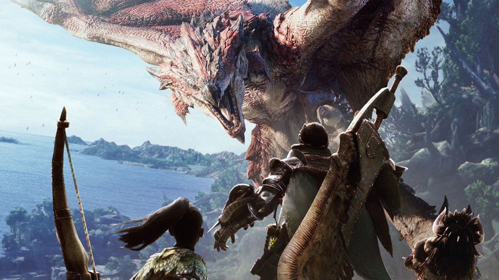

## My Favorite Game: Monster Hunter

####Development company: [Capcom Co., Ltd.](https://www.monsterhunter.com)

####The release date of the game: 2004

####The game engine used to make the game: MT Framework

####About why I love this game:
Actually, I am not a video game person. The main reason why I love this game is because of the soundtrack. The first time I heard the music of Monster Hunter was from The Game Award in 2018, and the series was Monster Hunter: World. After I watched The Game Award concert, I kept searching for other series of Monster Hunter. Occasionally, I found one of the soundtracks most attractive to me, which was called [Monster Hunter World Original Soundtrack: The Complete Experience.](https://www.youtube.com/watch?v=-yEL0ZrpzE8&t=8s) Moreover, I would like to dig into more information about this game, so I searched for some game  

